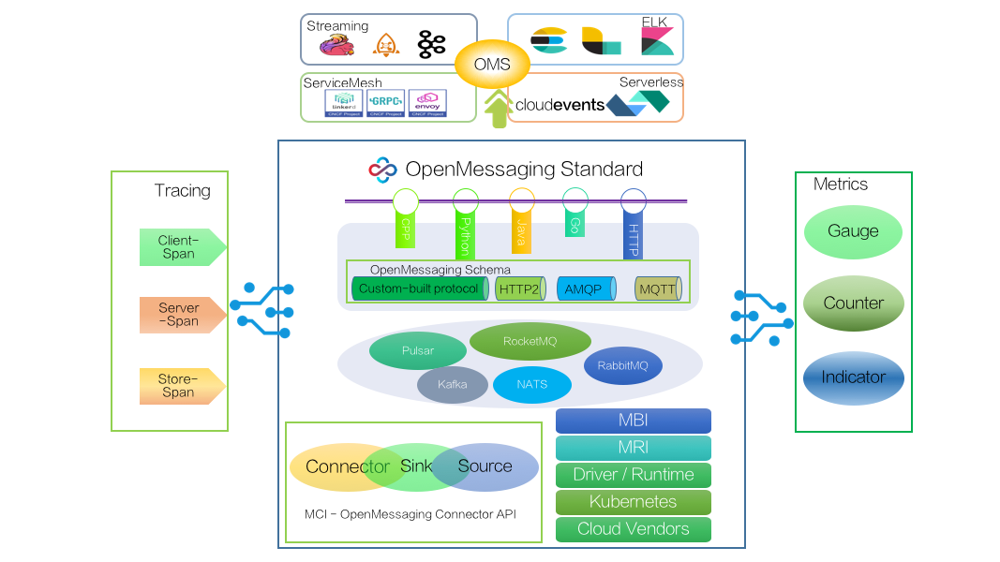

# The OpenMessaging Specification repository

This repository is a place to document (and discuss) the OpenMessaging specification itself (independent of any particular language or platform).

# Goals
OpenMessaging is vendor-neutral and language-independent, provides industry guidelines for areas of finance, e-commerce, IoT and big-data, and aimed to develop messaging and streaming applications across heterogeneous systems and platforms.

# Landscape

# OpenMessaging
Please see http://openmessaging.cloud/.

# Schema
    {       
    "messages": {
            "credential":{
                "type": "user", 
                "accountId": "123456789012", 
                "accessKeyId": "EXAMPLE_KEY_ID", 
                "userName": "Alice"
                   },
             "message":{
                  "headers":{"userHeaders":{},"sysHeaders":{}},
                  "properties"：{"messageId":"","bornTime":"","bornHost":"","storeTime":"","messageId":"","borenTime":"","bornHost":"","storeTime":"","deliveryTime":"","deliveryCount":"","ttl":"","correlationId":"","priority":"","traceId":"","transactionId":""},"bodies":{}
                      }
           }
    }

# Proposal
#### [specification](specification.md)
#### [use case](usecase.md)

# Communications
Chat with us on the OpenMessaging Slack in the #general channel: https://openmessaging.slack.com

